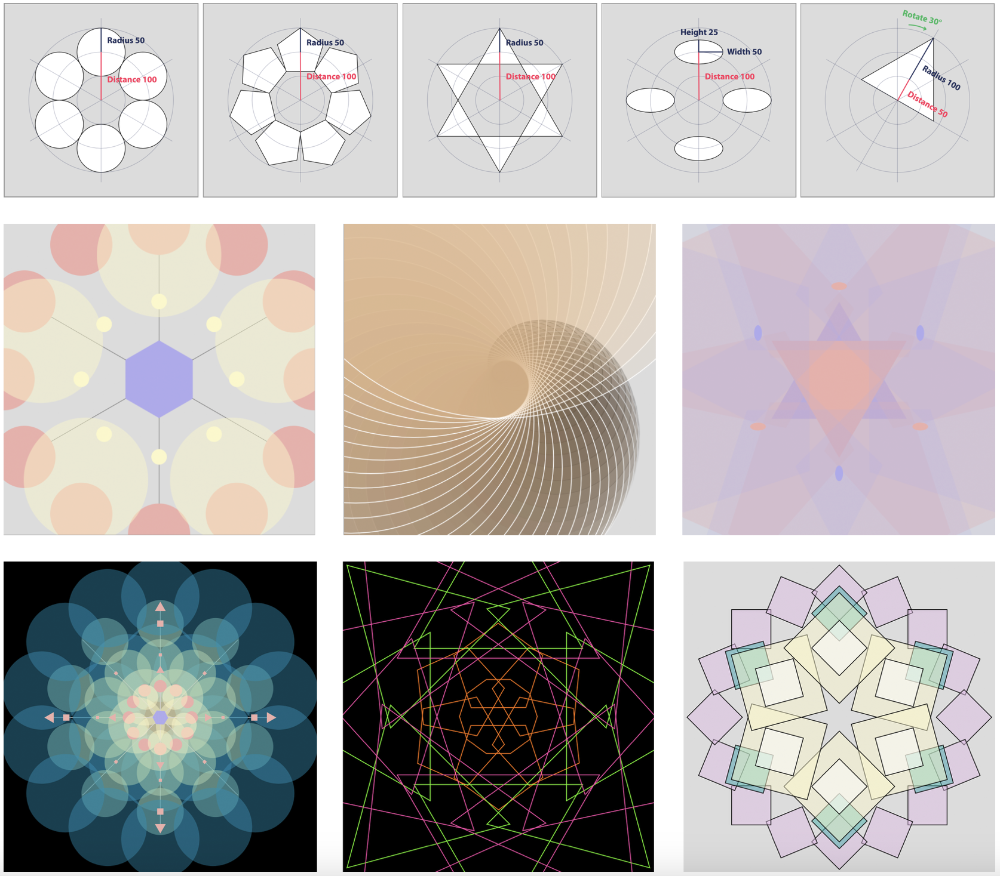

# IDEA9103 Week 9 Quiz

## Part 1
- I’m inspired by the ["Swarmalators" by Dirk Brockmann] (https://www.complexity-explorables.org/explorables/swarmalators/), which shows particles moving organically within a circular boundary. I’m particularly drawn to how the particles pulse, shift, and rotate randomly while maintaining an overall structure. This dynamic, playful motion feels like a perfect match for the circular motifs in Pacita Abad’s Wheels of Fortune (which would be our group’s chosen artwork to represent for the final project). I’d like to incorporate a similar sense of controlled chaos—circles drifting and interacting within bounds—to bring her vibrant, layered artwork to life. This technique supports our goal of animating the artwork. 

## Part 2
- To animate particles moving organically within a circular space, the [p5.Polar library](https://github.com/liz-peng/p5.Polar) is a great tool for implementation, which simplifies working with polar coordinates in p5.js. This library allows for intuitive placement and movement of shapes using angles and radii, aligning well with the circular motifs in Pacita Abad’s Wheels of Fortune. By leveraging functions like polarEllipse() and polarPolygon(), I can create dynamic, rotating patterns that emulate the artwork's vibrant energy. 

